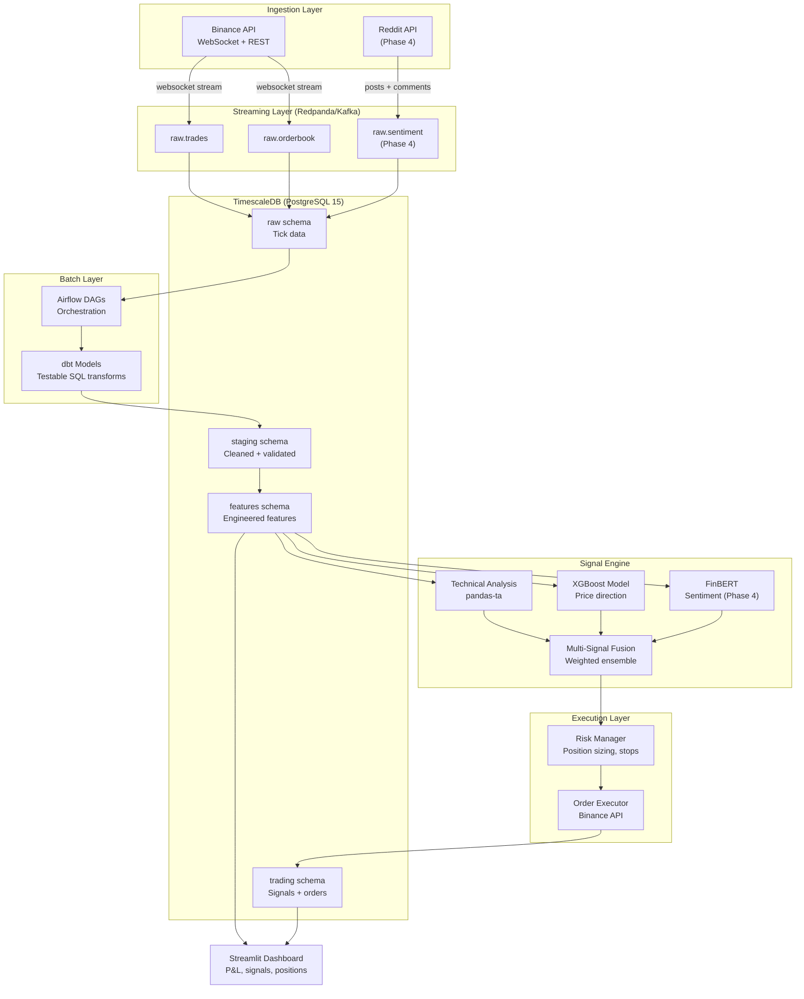

# Architecture

## System Diagram

## Design Decisions

### Redpanda over Apache Kafka
Redpanda is a Kafka-compatible broker written in C++ with no JVM dependency. For local development on a laptop, it starts in under 5 seconds and uses ~150 MB RAM vs ~1 GB for a minimal Kafka + Zookeeper setup. The Kafka API compatibility means every Kafka client library (`kafka-python`, Faust, etc.) works without modification. When moving to production, the broker can be swapped for Confluent Cloud or MSK with zero application code changes.

### TimescaleDB over plain PostgreSQL
Tick data and OHLCV features are time-series by nature. TimescaleDB's hypertables automatically partition data by time, reducing index size and dramatically improving range queries (e.g., "last 30 days of 1-minute BTCUSDT candles"). Continuous aggregates handle rollups from tick to 1m/5m/1h without a separate ETL job. Staying on PostgreSQL means dbt, Airflow, and any BI tool work natively — no additional connector complexity.

### dbt over raw SQL scripts
All feature transformations are dbt models: versioned, documented, and testable. dbt's built-in tests (`not_null`, `unique`, `accepted_values`) catch data quality regressions before they contaminate model training. The DAG lineage view makes it easy to trace a derived feature back to its raw source. This matters in trading, where a silently-wrong feature can cause a model to take the wrong side of a trade.

### Airflow over cron
Cron runs jobs in isolation with no dependency management, retry logic, or observability. Airflow provides DAG-level dependency ordering (e.g., "run feature engineering only after raw ingestion succeeds"), configurable retry policies, backfill for missed windows, and a UI for inspecting historical runs. The LocalExecutor is sufficient for a single-machine deployment; migrating to CeleryExecutor or KubernetesExecutor later requires only a config change.

## Tradeoffs (Not Production-Grade Yet)

| Area | Current state | Production requirement |
|---|---|---|
| Kafka | Single Redpanda broker, no replication | Multi-broker cluster with replication factor ≥ 2 |
| Schema registry | None — JSON messages with no enforcement | Confluent Schema Registry + Avro/Protobuf |
| Secrets management | `.env` file on disk | Vault, AWS Secrets Manager, or Docker secrets |
| Airflow executor | LocalExecutor (single process) | CeleryExecutor or KubernetesExecutor |
| Model serving | Inline prediction in signal engine | Separate model serving layer (BentoML, Seldon) |
| Monitoring | Streamlit dashboard (polling) | Grafana + Prometheus + Alertmanager |
| TLS/Auth | None between services | mTLS on Kafka, Airflow behind auth proxy |

These gaps are intentional for Phase 1. The scaffold is designed so each can be addressed incrementally without restructuring the codebase.

Local Development Notes
Windows: PostgreSQL Port Conflict
If you have PostgreSQL installed natively on Windows, it will also listen on port 5432 by default. This conflicts with the Docker Postgres container, causing connection errors like:
FATAL: password authentication failed for user "trader"
Even though the error looks like a password problem, the real cause is that your Python process is connecting to the Windows-native Postgres (port 5432) instead of the Docker Postgres container.
Solution applied in this project: Docker Postgres is mapped to port 5433 instead:
yaml# docker-compose.yml
postgres:
  ports:
    - "5433:5432"   # host:container
env# .env
POSTGRES_PORT=5433
This way both can coexist without conflict:
InstancePortUsed byWindows native Postgres5432Local Windows appsDocker Postgres (TimescaleDB)5433This project
If you don't have native Postgres installed, you can change this back to 5432:5432 — no other changes needed.
